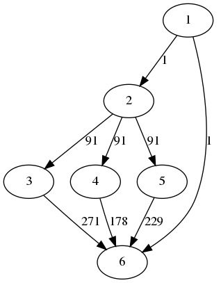
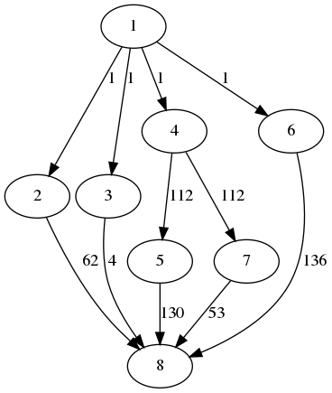
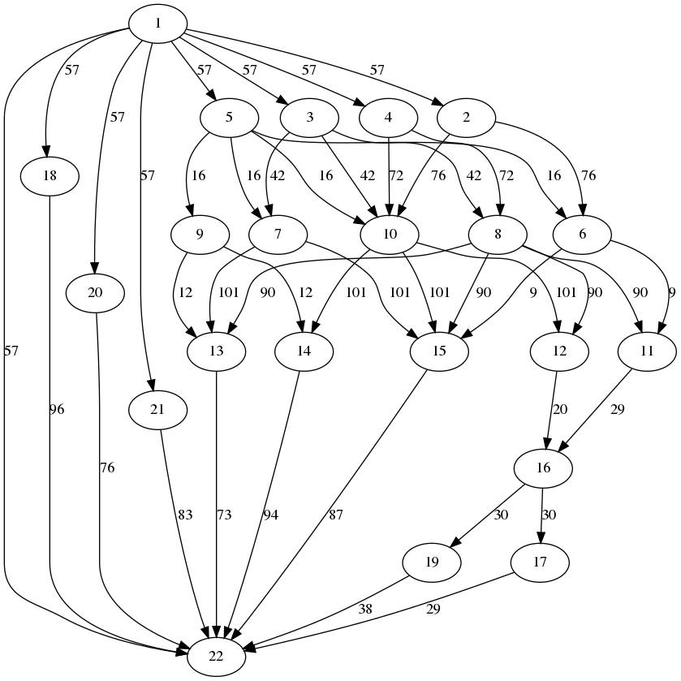
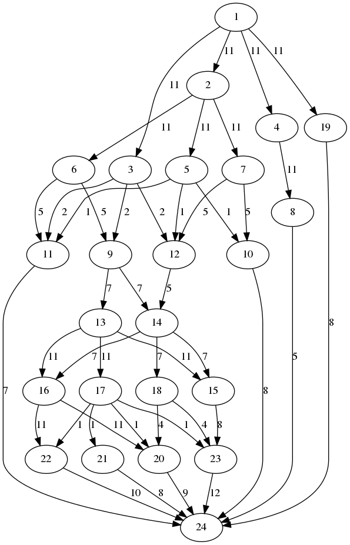
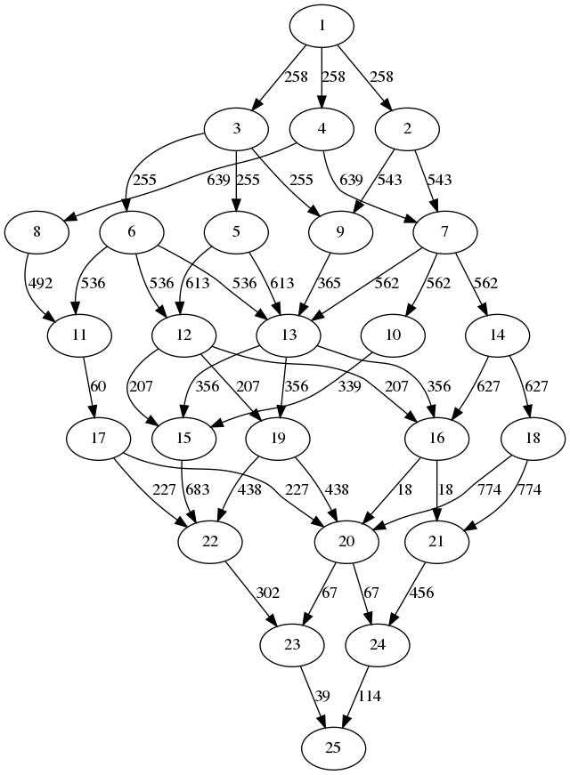

# Randomized Multi-DAG Task Generator for Scheduling and Allocation Research

[](https://www.python.org/)
[](https://GitHub.com/Naereen/StrapDown.js/graphs/commit-activity)
[](http://badges.mit-license.org)

**dag-gen-rnd** --- A randomized multiple Direct Acyclic Graph (DAG) task generator designed for scheduling and allocation research in parallel and multi-core computing. 

**dag-gen-rnd** supports both command line (`daggen-cli`) and graphical user interface (`daggen-gui`; in development). This generator can be easily configured through a `.json` file and is highly extensible for other purposes.

Supported generation algorithms:

- `nfj`: Nested fork-join
- `rnd`: standard randomized DAG (layer-by-layer)
- `rnd_legacy`: default randomized DAG

The utilization generation is based on:

- UUnifast
- UUnifast-discard

---

## Requirements

- `Python >= 3.7`
- `NetworkX >= 2.4`
- `Matplotlib >= 3.1.3`
- `pygraphviz >= 1.5`
- `numpy >= 1.17`
- `tqdm >= 4.45.0`
- `pyqt5` (optional for GUI)

---

## Installation on Linux

Install dependencies using apt:

`$ sudo apt install python3-dev graphviz libgraphviz-dev pkg-config`

and then install Python depedencies through `requirements.txt`:

`$ pip3 install -r requirements.txt`

(Optional) To use the GUI, you need to install Qt5 for python:

`$ sudo apt install python3-pyqt5`

---

## Configuration

Use the configuration file `config.json` to configure parameters.

To generate single DAG task, set `multi-DAG`=`false`, then in `single_task`:

- `multi-DAG`: false
- `set_number`: number of tasksets
- `workload`: sum(C_i)

To generate multi-DAG taskset, set `multi-DAG`=`true`, then in `multi_task`:

- `set_number`: number of tasksets
- `utilization`: total utilization
- `task_number_per_set`: number of tasks in each taskset
- `periods`: period set candidates

---

## Usage

First, change the configurations in `config.json`. Then, depending on your perference:

### 1. Use the command line interface

`$ python3 src/daggen-cli.py`


### 2. Use the graphic user interface (development in process)

`$ python3 src/daggen-gui.py`

To use the generated DAGs, see the provided API in `utlity.py` which also gives an example.

---

## Examples

Here are some simple examples of generated DAGs:






or more complicated DAGs:







---

## Known Issues

1. This code is not tested on Windows, but it should not have too many problems. The only potential issue is that the difference is in folder naming where Windows uses a backslash (`\`), instead of a forwardslash (`/`). I will test it and make it compatitable in the future. 
2. In some cases, the critical path could be larger than the period.

---

## Publications used the generator

- Shuai Zhao, Xiaotian Dai, Iain Bate. "DAG Scheduling and Analysis on Multi-core Systems by Modelling Parallelism and Dependency". Transactions on Parallel and Distributed Systems (TPDS). IEEE. 2022.
- Shuai Zhao, Xiaotian Dai, Iain Bate, Alan Burns, Wanli Chang. "DAG scheduling and analysis on multiprocessor systems: Exploitation of parallelism and dependency". In Real-Time Systems Symposium (RTSS), pp. 128-140. IEEE, 2020.

---

## Citation

Please use the following citation if you use this code for your work: 

```
Xiaotian Dai. (2022). dag-gen-rnd: A randomized multi-DAG task generator for scheduling and allocation research (v0.1). Zenodo. https://doi.org/10.5281/zenodo.6334205
```

BibTex:

```
@software{xiaotian_dai_2022_6334205,
  author       = {Xiaotian Dai},
  title        = {{dag-gen-rnd: A randomized multi-DAG task generator 
                   for scheduling and allocation research}},
  month        = mar,
  year         = 2022,
  publisher    = {Zenodo},
  version      = {v0.1},
  doi          = {10.5281/zenodo.6334205},
  url          = {https://doi.org/10.5281/zenodo.6334205}
}
```

---

## License

This software is licensed under MIT. See [LICENSE](LICENSE) for details.

[](http://badges.mit-license.org)
