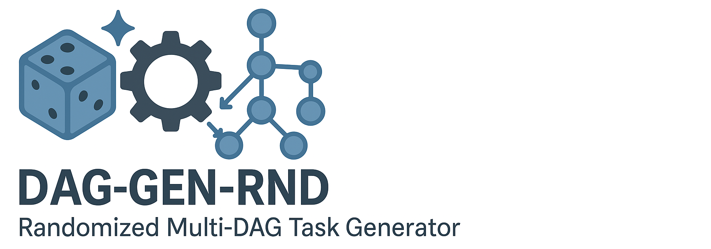

# Randomised Multi-DAG Task Generator for Scheduling and Allocation



[](https://www.python.org/)
[](https://GitHub.com/Naereen/StrapDown.js/graphs/commit-activity)
[](http://badges.mit-license.org)

The **dag-gen-rnd** is a randomised multiple Directed Acyclic Graph (DAG) task generator designed for scheduling and allocation research in parallel and multi-core computing. 
**dag-gen-rnd** supports both command line (`daggen-cli`) and graphical user interface (`daggen-gui`; in development). This generator can be easily configured through a `.json` file and is highly extensible for other purposes.

Support the following DAG generation algorithms:

- `nfj`: Nested fork-join
- `rnd`: standard randomised DAG (layer-by-layer; LBL)
- `rnd_legacy`: default randomised DAG

Supported utilisation generation algorithms:

- `UUnifast` [1]
- `UUnifast-discard` [2]

References:  

[1] Bini, Enrico, and Giorgio C. Buttazzo. "Measuring the performance of schedulability tests." Real-Time Systems 30, no. 1 (2005): 129-154.  
[2] Davis, Robert I., and Alan Burns. "Improved priority assignment for global fixed priority pre-emptive scheduling in multiprocessor real-time systems." Real-Time Systems 47, no. 1 (2011): 1-40.  
[3] Griffin, David, Iain Bate, and Robert I. Davis. "Generating utilization vectors for the systematic evaluation of schedulability tests." In 2020 IEEE Real-Time Systems Symposium (RTSS), pp. 76-88. IEEE, 2020.

---

## Requirements

- `Python >= 3.7`
- `NetworkX >= 2.4`
- `Matplotlib >= 3.1.3`
- `pygraphviz >= 1.5`
- `numpy >= 1.17`
- `tqdm >= 4.45.0`
- `pyqt5` (optional for GUI)

---

## Installation on Linux

Install dependencies using apt:

`$ sudo apt install python3-dev graphviz libgraphviz-dev pkg-config`

and then install Python dependencies through `requirements.txt`:

`$ pip3 install -r requirements.txt`

(Optional) To use the GUI, you need to install Qt5 for Python:

`$ sudo apt install python3-pyqt5`

---

## Configuration

Use the configuration file `config.json` to configure parameters.

### Single DAG

To generate a single DAG task, set `multi-DAG=false`, then in `single_task`:

- `multi-DAG`: false
- `set_number`: number of tasksets
- `workload`: sum(C_i)

### Multiple DAGs

To generate a multi-DAG taskset, set `multi-DAG=true`, then in `multi_task`:

- `set_number`: number of tasksets
- `utilization`: total utilisation
- `task_number_per_set`: number of tasks in each taskset
- `periods`: period set candidates

---

## Usage

### Use the cli

First, change the configurations in `config.json`. Then, run the command line interface:

`$ python3 src/daggen-cli.py`


### Use the GUI (development in process)

`$ python3 src/daggen-gui.py`

To use the generated DAGs, see the provided API in `utlity.py` which also gives an example.

---

## Examples

Here are some simple examples of generated DAGs:

||||
|--|--|--|

or more complicated DAGs that can also be generated:

|||
|--|--|

---

## Known Issues

1. In some cases, the workload of the critical path could be larger than the period. The generator does not prohibit this case as this is not treated as a bug (as you can distribute the workload to multiple cores). The users need to be awareof  this and deal with them in their favourite way, e.g. discarding.
2. If you get an error while building pygraphviz during installing the dependencies, install graphviz with `apt install graphviz graphviz-dev`.

---

## Academic Use of the Generator

The generator is featured in multiple academic papers:

1. Ping, Yani, Kun Xie, Xiaohong Huang, Chengcheng Li, and Yasheng Zhang. "GNN-Based QoE Optimization for Dependent Task Scheduling in Edge-Cloud Computing Network." In 2024 IEEE Wireless Communications and Networking Conference (WCNC), pp. 1-6. IEEE, 2024.
1. Zhang, Yuanhai, Shuai Zhao, Gang Chen, and Kai Huang. "Fault-tolerant DAG scheduling with runtime reconfiguration on multicore real-time systems." In 2024 IEEE 35th International Conference on Application-specific Systems, Architectures and Processors (ASAP), pp. 19-27. IEEE, 2024.
1. Kang, Hong, Minghao Li, Lehao Lin, Sizheng Fan, and Wei Cai. "Bridging Incentives and Dependencies: An Iterative Combinatorial Auction Approach to Dependency-Aware Offloading in Mobile Edge Computing." IEEE Transactions on Mobile Computing, 2024.
1. Cucinotta, Tommaso, Alexandre Amory, Gabriele Ara, Francesco Paladino, and Marco Di Natale. "Multi-criteria optimization of real-time DAGs on heterogeneous platforms under p-EDF." ACM Transactions on Embedded Computing Systems 23, no. 1, 2024.
1. Shuai Zhao, Xiaotian Dai, Iain Bate, Alan Burns, Wanli Chang. "DAG scheduling and analysis on multiprocessor systems: Exploitation of parallelism and dependency." In Real-Time Systems Symposium (RTSS), pp. 128-140. IEEE, 2020.
1. Shuai Zhao, Xiaotian Dai, Iain Bate. "DAG Scheduling and Analysis on Multi-core Systems by Modelling Parallelism and Dependency." Transactions on Parallel and Distributed Systems (TPDS). IEEE, 2022.

---

## Citation

Please cite the following paper if you use this software in your research: 

```
Shuai Zhao, Xiaotian Dai, Iain Bate, Alan Burns, Wanli Chang. "DAG scheduling and analysis on multiprocessor systems: Exploitation of parallelism and dependency". In Real-Time Systems Symposium (RTSS), pp. 128-140. IEEE, 2020.
```

BibTex:

```
@inproceedings{zhao2020dag,
  title={DAG scheduling and analysis on multiprocessor systems: Exploitation of parallelism and dependency},
  author={Zhao, Shuai and Dai, Xiaotian and Bate, Iain and Burns, Alan and Chang, Wanli},
  booktitle={2020 IEEE Real-Time Systems Symposium (RTSS)},
  pages={128--140},
  year={2020},
  organization={IEEE}
}
```

Alternatively, if you want to cite the software:

```
Xiaotian Dai. (2022). dag-gen-rnd: A randomised multi-DAG task generator for scheduling and allocation research (v0.1). Zenodo. https://doi.org/10.5281/zenodo.6334205
```

BibTex:

```
@software{xiaotian_dai_2022_6334205,
  author       = {Xiaotian Dai},
  title        = {{dag-gen-rnd: A randomised multi-DAG task generator 
                   for scheduling and allocation research}},
  month        = mar,
  year         = 2022,
  publisher    = {Zenodo},
  version      = {v0.1},
  doi          = {10.5281/zenodo.6334205},
  url          = {https://doi.org/10.5281/zenodo.6334205}
}
```

---

## License

This software is licensed under MIT. See [LICENSE](LICENSE) for details.

[](http://badges.mit-license.org)
